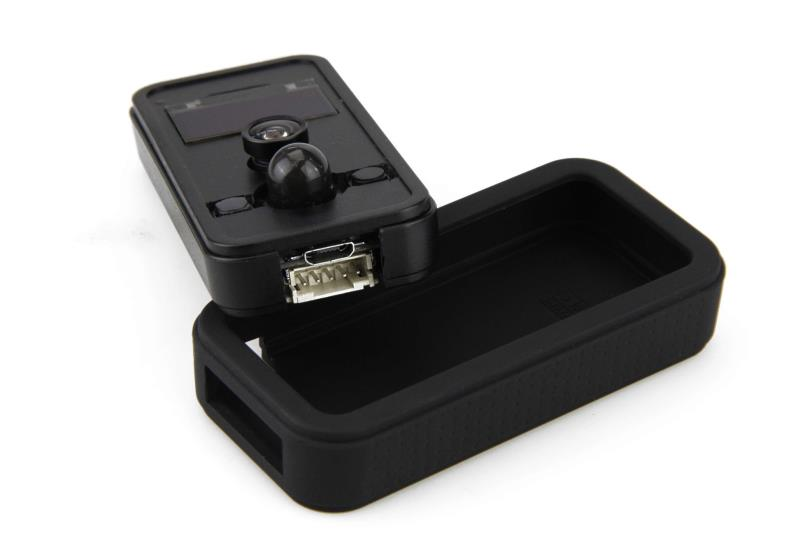
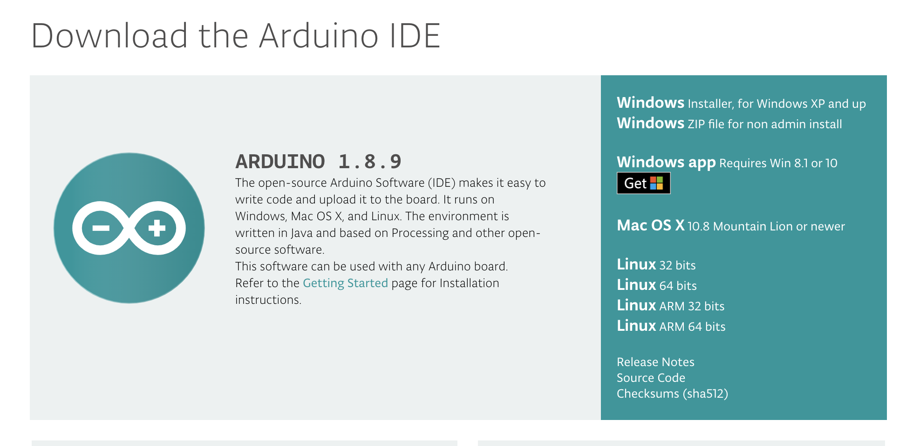
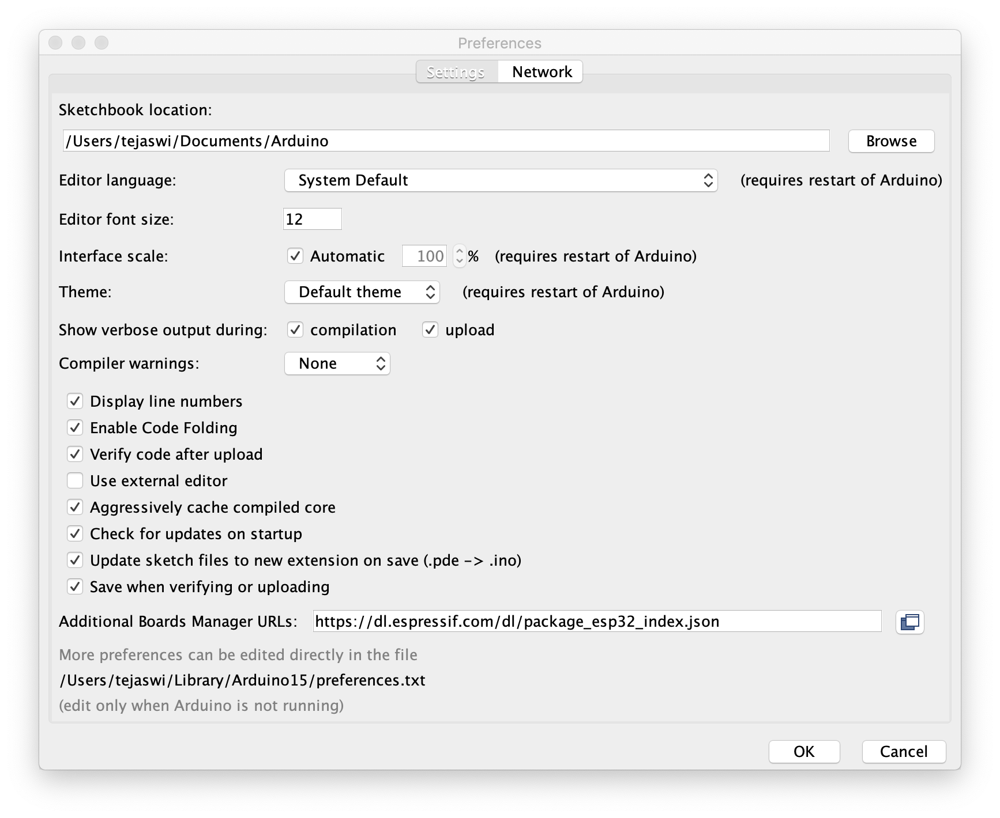
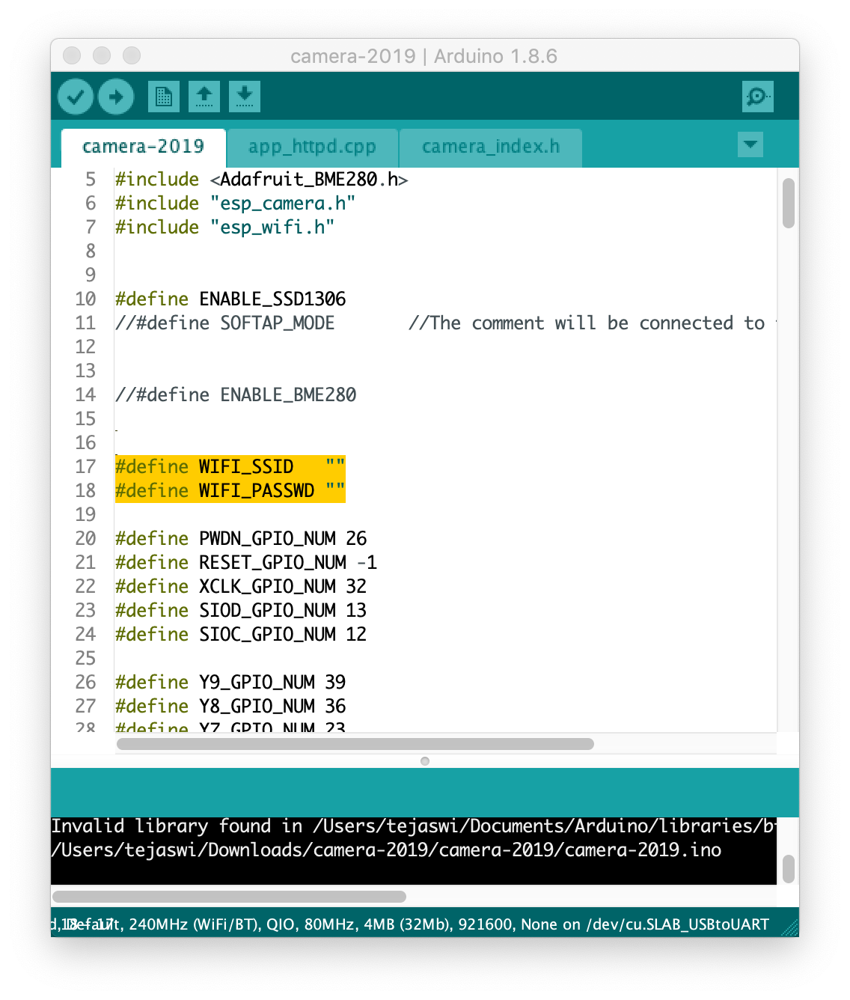
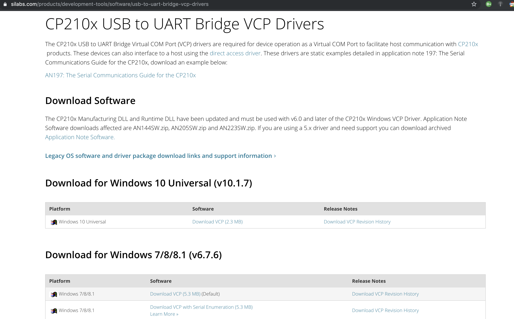
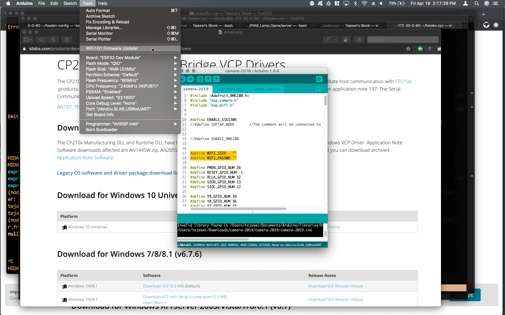
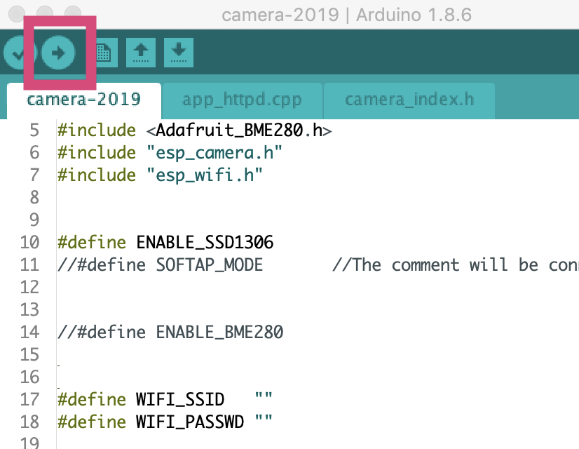

# DIY Code


## Usage
1. Clone or download repository
2. Download and install Arduino:
  <https://www.arduino.cc/en/Main/Software>

3. Add this to your boards: https://dl.espressif.com/dl/package_esp32_index.json
   
   

    (more instructions:
<https://github.com/espressif/arduino-esp32/blob/master/docs/arduino-ide/boards_manager.md>)

4. Open `camera-2019.ino`

5. Install USB to UART Driver:
   <https://www.silabs.com/products/development-tools/software/usb-to-uart-bridge-vcp-drivers>

6. Connect camera via USB cable and choose your port in Arduino IDE.
   (Make sure PSRAM is "Enabled").

7. Compile and run!


## Configuration
Line 11.

```
//#define SOFTAP_MODE 
```

Commenting it will connect it to your home router.
Provide wifi router credentials in lines 17,18

```
#define WIFI_SSID   ""
#define WIFI_PASSWD ""
```

## Further Reading
1. AWS Kinesis: https://aws.amazon.com/quickstart/architecture/camera-connector-onica/
2. AWS Rekognition: https://aws.amazon.com/rekognition/
